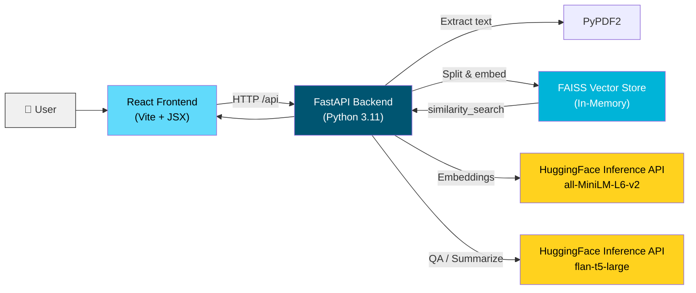

# AI-Powered PDF Assistant

[](https://python.org)
[](https://fastapi.tiangolo.com/)
[](https://react.dev)
[](https://langchain.com)
[](https://huggingface.co)
[](https://github.com/facebookresearch/faiss)
[](https://docker.com)
[](https://railway.app)
[](https://netlify.com)

Upload PDF documents and ask natural language questions about their content. Uses LangChain + HuggingFace for embeddings and question-answering, FAISS for vector search, with a React frontend and FastAPI backend.

🔗 **Live demo:** [https://ai-pdf-assistant.netlify.app](https://ai-pdf-assistant.netlify.app)

## Features

- **PDF Upload & Parsing** — Drag-and-drop PDF upload with automatic text extraction and chunking
- **Natural Language Q&A** — Ask questions in plain English, get AI-generated answers with source citations
- **One-Click Summarization** — Generate a concise summary of any uploaded document
- **Vector Search** — FAISS-powered similarity search finds the most relevant document sections
- **Source Citations** — Every answer includes page references so you can verify the source
- **Multi-Document Support** — Upload and switch between multiple PDFs
- **Dockerized Setup** — One command to run the entire stack

## Architecture



### Data Flow

```
User Uploads PDF
    ↓
PyPDF2 extracts text page-by-page
    ↓
RecursiveCharacterTextSplitter chunks into 1000-token segments (200 overlap)
    ↓
all-MiniLM-L6-v2 (HuggingFace) generates embeddings for each chunk
    ↓
FAISS indexes embeddings for similarity search
    ─────────────────────────────────────────────────────
User Asks a Question
    ↓
FAISS retrieves top-4 most relevant chunks (by cosine similarity)
    ↓
flan-t5-large (HuggingFace) generates answer from retrieved context
    ↓
Answer returned with page citations
```

## Tech Stack

| Layer | Technology | Purpose |
|-------|-----------|---------|
| Frontend | React 18, Vite, Lucide Icons | Drag-drop upload, chat interface |
| Backend | FastAPI, Uvicorn | Async REST API |
| Embeddings | HuggingFace `all-MiniLM-L6-v2` (Inference API) | Semantic text embeddings |
| LLM | HuggingFace `google/flan-t5-large` (Inference API) | Question answering & summarization |
| Vector DB | FAISS (in-memory) | Cosine similarity search |
| PDF Processing | PyPDF2 | Text extraction from PDF files |
| Containerization | Docker, Docker Compose, Nginx | Production-ready deployment |
| Deploy (Backend) | Railway | Cloud hosting with auto-deploy |
| Deploy (Frontend) | Netlify | Static hosting with CI/CD |

### Architecture Decisions

**Why HuggingFace over OpenAI?**
- Cost: HuggingFace Inference API offers generous free tier (30k input tokens/min)
- Flexibility: Can swap models without changing providers
- Open-source: Models are publicly auditable and community-maintained
- Trade-off: Response quality is slightly below GPT-3.5/4, but sufficient for document Q&A

**Why FAISS (in-memory)?**
- Zero infrastructure: No need for a separate vector database service
- Fast: Sub-millisecond search for document-scale collections
- Trade-off: Indexes are ephemeral — lost on server restart. Acceptable for a demo/tool.

## Screenshots

<!-- TODO: Add screenshots of the app in action -->
<!-- 


-->

*Screenshots coming soon. The live demo is the best way to see it in action.*

## Quick Start

### Option 1: Docker (Recommended)

```bash
git clone https://github.com/kish-00/ai-pdf-assistant.git
cd ai-pdf-assistant

# Set your HuggingFace token
cp .env.example .env
# Edit .env and add your HUGGINGFACEHUB_API_TOKEN
# Get one at https://huggingface.co/settings/tokens

# Build and run
docker compose up --build
```

Open [http://localhost:3000](http://localhost:3000)

### Option 2: Local Developmente venv/bin/activate  # Windows: venv\Scripts\activate
pip install -r requirements.txt

# Set environment variables
cp .env.example .env
# Edit .env and add your HUGGINGFACEHUB_API_TOKEN
# Get one at https://huggingface.co/settings/tokens

uvicorn app.main:app --reload --port 8000
```

**Frontend:**

```bash
cd frontend
npm install
npm run dev
```

Open [http://localhost:5173](http://localhost:5173)

## API Endpoints

| Method | Endpoint | Description |
|--------|----------|-------------|
| `POST` | `/api/pdf/upload` | Upload a PDF file |
| `GET` | `/api/pdf/documents` | List all uploaded documents |
| `DELETE` | `/api/pdf/{doc_id}` | Delete a document |
| `POST` | `/api/chat/ask` | Ask a question about a document |
| `POST` | `/api/chat/summarize/{doc_id}` | Generate a document summary |
| `GET` | `/api/health` | Health check |

### Example Requests

**Upload a PDF:**
```bash
curl -X POST http://localhost:8000/api/pdf/upload \
  -F "file=@document.pdf"
```

**Ask a question:**
```bash
curl -X POST http://localhost:8000/api/chat/ask \
  -H "Content-Type: application/json" \
  -d '{"doc_id": "your-doc-id", "question": "What are the key findings?"}'
```

## Project Structure

```
ai-pdf-assistant/
├── backend/
│   ├── app/
│   │   ├── main.py              # FastAPI app entry point
│   │   ├── routes/
│   │   │   ├── pdf.py           # PDF upload/delete endpoints
│   │   │   └── chat.py          # Q&A and summarization endpoints
│   │   └── services/
│   │       └── vector_store.py  # FAISS indexing & LangChain QA
│   ├── requirements.txt
│   ├── Dockerfile
│   └── .env.example
├── frontend/
│   ├── src/
│   │   ├── App.jsx              # Main app with state management
│   │   ├── components/
│   │   │   ├── Header.jsx       # App header
│   │   │   ├── UploadZone.jsx   # Drag-and-drop PDF upload
│   │   │   ├── DocumentList.jsx # Sidebar document list
│   │   │   └── ChatPanel.jsx    # Chat Q&A interface
│   │   ├── services/
│   │   │   └── api.js           # API client
│   │   └── styles/
│   │       └── global.css       # App styles
│   ├── index.html
│   ├── vite.config.js
│   ├── nginx.conf
│   └── Dockerfile
├── docker-compose.yml
├── .env.example
└── .gitignore
```

## Configuration

| Variable | Default | Description |
|----------|---------|-------------|
| `HUGGINGFACEHUB_API_TOKEN` | — | HuggingFace Inference API token ([get one](https://huggingface.co/settings/tokens)) |
| `UPLOAD_DIR` | `./uploads` | Directory for uploaded PDFs |
| `MAX_FILE_SIZE_MB` | `20` | Maximum PDF file size |

## Future Enhancements

- [ ] Persistent vector storage (ChromaDB/Pinecone) for documents across restarts
- [ ] Support for multiple file formats (DOCX, TXT, CSV)
- [ ] Conversation memory for follow-up questions
- [ ] Streaming responses via Server-Sent Events
- [ ] User authentication and document ownership
- [ ] Batch document upload and cross-document Q&A

## License

MIT
